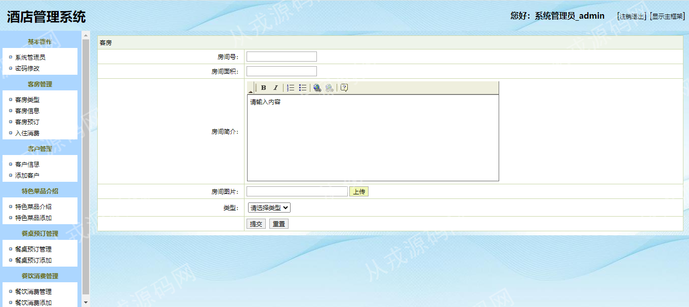
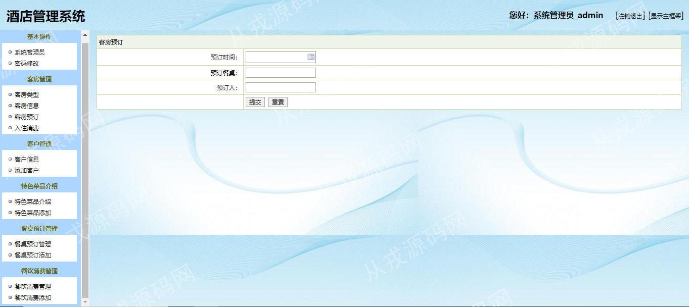

<h1 align="center">58.酒店管理系统</h1>

- <b>完整代码获取地址：从戎源码网 ([https://armycodes.com/](https://armycodes.com/))</b>
- <b>技术探讨、资料分享，请加QQ群：692619798</b> 
- <b>作者微信：19941326836  QQ：952045282</b> 
- <b>承接计算机毕业设计、Java毕业设计、Python毕业设计、深度学习、机器学习</b>
- <b>选题+开题报告+任务书+程序定制+安装调试+论文+答辩ppt 一条龙服务</b>
- <b>所有选题地址 ([https://github.com/YuLin-Coder/AllProjectCatalog](https://github.com/YuLin-Coder/AllProjectCatalog)) </b>

## 项目介绍
基于servlet+jsp的酒店管理系统：前端jsp、dtree，后端 servlet、jdbc，集成客房管理、客户管理、特色菜品信息、餐桌预定、餐饮消费等功能于一体的系统。

## 功能介绍

- 客房类型管理：客房类型的增删查改
- 客房信息：客房信息的增删改查、需要绑定客房类型、房间简介支持富文本编辑、可以上传房间图片
- 客房预定：客房预定信息的添加和删除、需要绑定客房信息
- 入住消费：入住信息的添加和删除、需要绑定客房信息
- 客户信息：客户信息的增删改查、客户名称关键词搜索
- 特色菜品：特色菜品信息添加、特色菜品信息删除、描述信息支持富文本编辑、菜品图片上传
- 餐桌预定：餐桌预定信息添加、删除
- 餐饮消费：餐饮消费信息添加、删除
- 基本操作：系统管理员添加和删除、密码修改、登录、安全退出

## 环境

- <b>IntelliJ IDEA 2009.3</b>

- <b>Mysql 5.7.26</b>

- <b>Tomcat 7.0.73</b>

- <b>JDK 1.8</b>

## 运行截图

